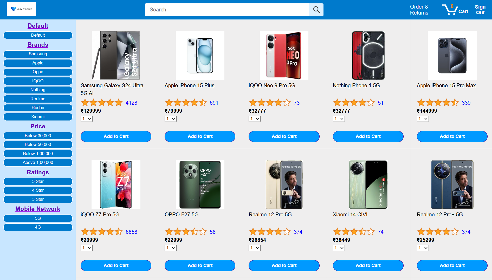

# Mobile-Shop-E-Commerce

## Overview
**Mobile Shop E-Commerce** is a full-stack web application designed for a mobile shop. It enables users to browse mobile products, add them to the cart, and complete secure payments using Stripe. The application also includes an invoice generation feature for purchases.

## Features
### Customer Functionalities:
- **User Authentication**: Secure login and registration system.
- **Product Browsing**: View a wide range of mobile products with details.
- **Shopping Cart**: Add, remove, and update cart items.
- **Secure Payments**: Stripe integration for seamless transactions.
- **Order History**: View past orders and invoices.
- **Invoice Generation**: Download PDF invoices for completed purchases.

### Admin Functionalities:
- **Admin Authentication**: Secure login system for admin users.
- **Product Management**: Add and delete mobile products.
- **Order Management**: View and manage all customer orders.
- **User Management**: Manage registered customers.

## Screenshots
### Homepage

## Technologies Used
### Frontend:
- HTML, CSS, JavaScript

### Backend:
- Node.js, Express.js
- MySQL (Database)

### Payment Gateway:
- Stripe

### PDF Invoice Generation:
- pdf-lib

## Installation
### Prerequisites
- Node.js and npm installed
- MySQL installed and running

## Usage
### For Customers:
1. Register/Login as a user.
2. Browse mobile products and add them to the cart.
3. Proceed to checkout and make a secure payment.
4. View order history and download invoices.

### For Admins:
1. Log in as an admin.
2. Manage product inventory (add/delete products).
3. View and process customer orders.
4. Manage users.

## Contact  
For any issues or suggestions, feel free to reach out:  
- **GitHub**: [Prasad Nayak](https://github.com/PrasadNayak01) & [Om Khanvilkar](https://github.com/OmKhanvilkar)
- **Project Partner**: [Om Khanvilkar](https://github.com/OmKhanvilkar)